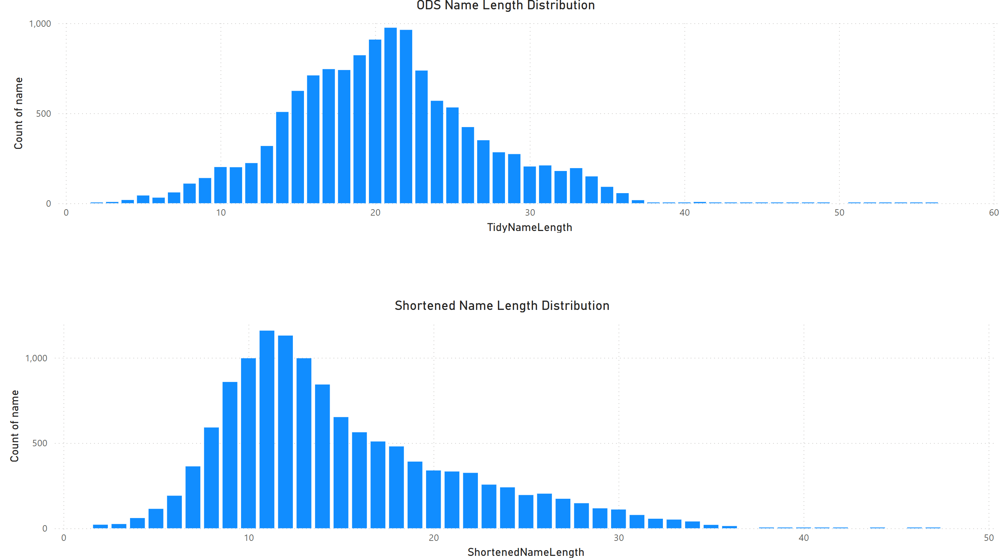
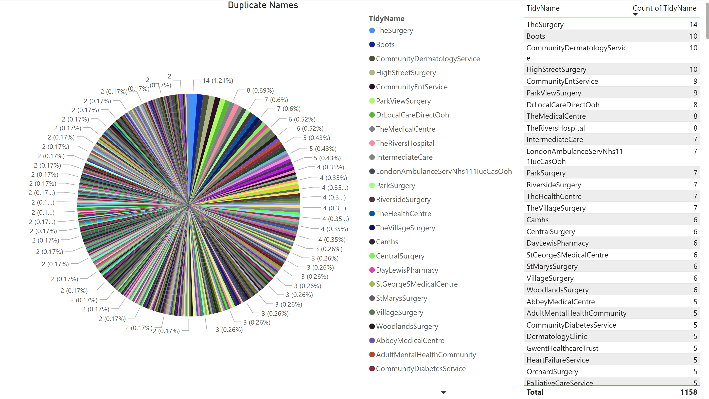

# Sender Identification: 0.1.0-alpha

Designing a standard to support digital messaging sender identifications for NHS Organisations.

## Version History

To follow [semantic versioning v2](https://semver.org/).

### 0.1.0-alpha 2025-03-21

Initial Draft.

## Aims

- provide a standard to aid uk mobile network operators complete RBM agent identity verification
- provide guidance for when to apply the NHS rule checks
- provide a standardised algorithm for generating sender ids for each NHS organisation

TODO: Complete aims

## Contributors

## Name Analysis

TODO: Complete aims

## RCS

### RCS Business Messaging

- https://developers.google.com/business-communications/rcs-business-messaging 
- https://sinch.com/apis/messaging/rcs/
- https://cpaas.webex.com/business-messaging/rcs-business-messaging
- https://business.bt.com/insights/what-is-rich-business-messaging/

#### Display Name

##### Version One

This would represent a specific agent for the organisation, eg NHS Martian Trust Pharmacy

"NHS [Short Org Name] [Agent Name]" - Max length 30 characters

[Short Org Name] - Max 16 characters - defined by this standard

[Agent Name] - Max 10 characters - available for organization to set

##### Version Two

This would represent a general agent for the organisation, eg eg NHS Martian Hospital Trust

"NHS [Medium Org Name] [Agent Name]" - Max length 30 characters

[Medium Org Name] - Max 26 characters - defined by this standard

#### Description

"NHS [Full Org Name] ([ODS Code]) [Agent Name] [Agent Description]"

[Full Org Name] - Full org name from ODS

[ODS Code] - Org ODS code

[Agent Description] - available for organization to set.

#### Logos and Hero Images

- hero image?
- logo?

Sizes - resolutions?

TODO: Define logo and image requirements

#### NHS NO Reply

- Requirement for NHSNoReply as the prefix - as RCS is only 2 way, and won't show "Not deleivered". It will show delivered, even if an auto reply from the agent comes back saying "This isn't monitored, phone agent on, phone 111, or phone our or 999 etc".
- 

## Short Org Name

Standard rule for generating a short name from the full ODS organization name.

To consider:

- Standard abbreviations
  - geographic eg London -> ldn
  - common words eg general practise -> gp
  - conjuctions eg and &
- Organisation types
- Spacing and punctuation

Additionally:

- NHS Orgs vs Orgs that provide services on behalf of NHS

To author:

- algorithm to generate the short name from a given string
- version releases of full output for all ODS codes - giving a referenceable artifact that can be used

### Agent Name

Initially Agent name can be chosen from:

- Pharmacy
- Outpatient
- Date? (Appointment is 11?)
- Survey
- Feedback
- 

Relax this list in future? Allow ad hoc?

## Defined list

[ODS List](ods.yml)

[RBM Organisation list](senderids.yml)

## Trigger / Protected characteristics

Always require if display name or description containing:

- NHS
- An NHS ODS Code

### Secondary triggers

- Hospital
- General Practise
- Pharmacy
- Doctor
- Ambulance

Exclude if:

- If a registered hospital / doctor / medical org, that is private, ie not NHS.

## Glossary

Terms

- RCS
- RBM

## Resources

[developers.google.com - RCS Business Messaging - Edit agent information](https://developers.google.com/business-communications/rcs-business-messaging/guides/build/agents/edit-agent-information)

## Review

Proposal to review 6 months after version 1 released.